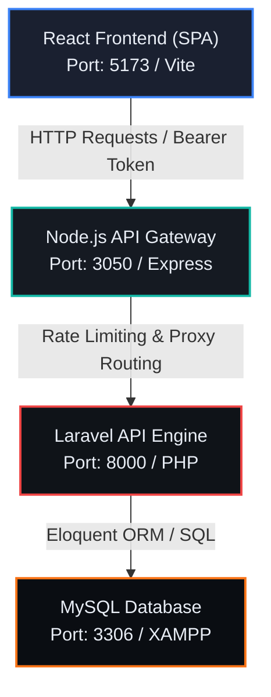
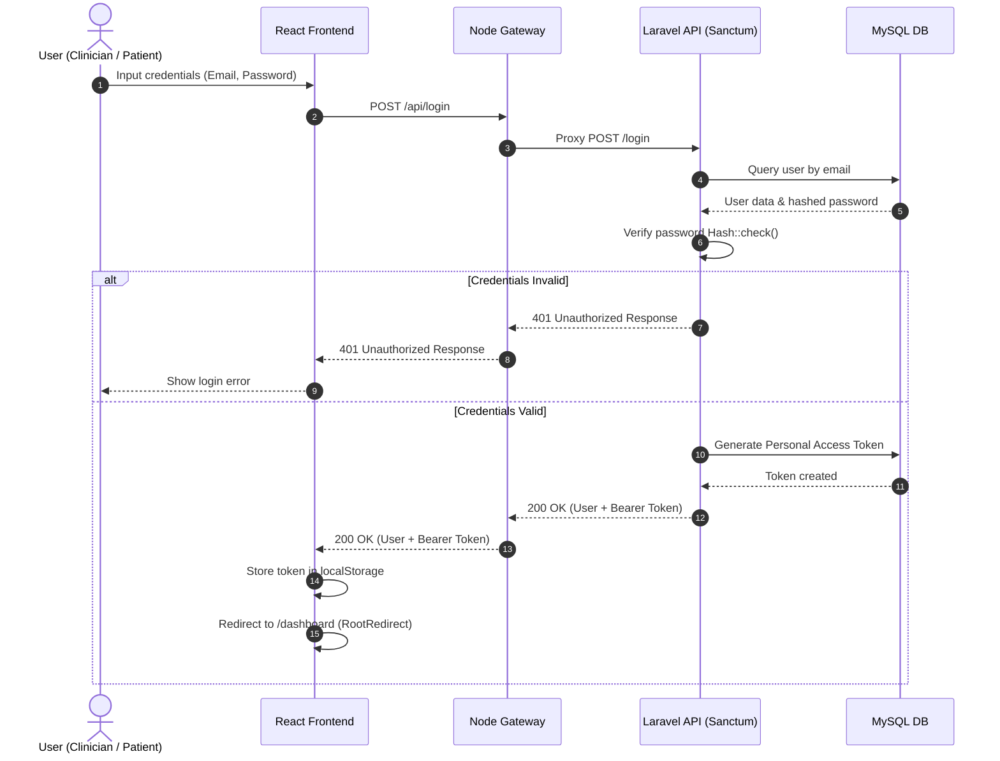
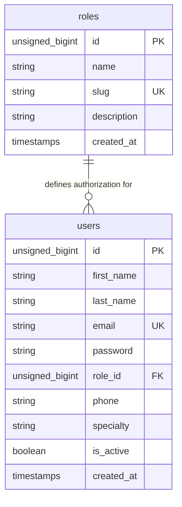

# Clinique Mounsif — System Architecture & Conception

This document holds the conception design diagrams and architectural blueprints for **Clinique Mounsif**. It is updated continuously as we implement features.

---

## 1. System Overview Architecture

The following diagram illustrates the data flow and communication protocols between the Frontend, Node.js API Gateway, Laravel API, and MySQL database:

---

## 2. Authentication Flow (Sanctum)

This sequence diagram details the login process, Sanctum token generation, and role checks:

---

## 3. Database Schema (Initial Clean Slate)

The initial Entity Relationship Diagram (ERD) representing our secure, RBAC-driven authentication structure:

